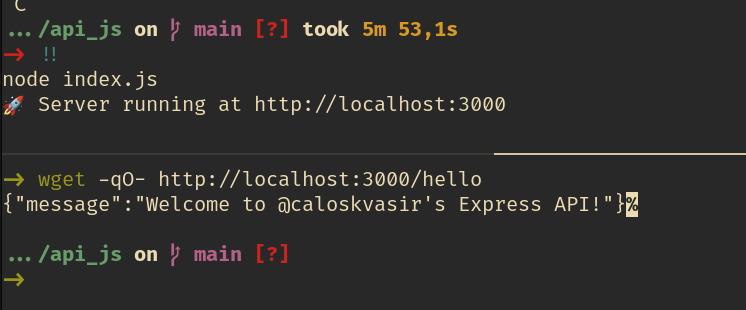

# API JS

A simple API for practicing backend fundamentals, developed for the Web 2 course in the Software Engineering program at UTFPR.

## Preview



## About the Project

This project implements a REST API using Node.js and Express, serving as a foundation to explore fundamental backend development concepts. It includes examples of routes, middlewares, and data handling.

## Technologies Used

- **Node.js** (v18+): JavaScript runtime environment.
- **Express**: Minimalist framework for building web servers.
- **JavaScript**: Programming language used in the project.

## Requirements

- **Node.js** version 18.0.0 or higher.
- **npm** (Node.js package manager).

## Installation

1. Clone the repository:
   ```bash
   git clone git@github.com:carloskvasir/api_js.git
   cd api_js
   ```

2. Install the dependencies:
   ```bash
   npm install
   ```

3. Start the server:
   ```bash
   npm start
   ```

## Available Endpoints

### GET /hello
Returns a simple JSON response to verify the API is working correctly.

**Example Request:**
```bash
curl -X GET http://localhost:3000/hello
```

**Example Response:**
```json
{
  "message": "Welcome to @caloskvasir's Express API!"
}
```

## Development Roadmap

- [x] Implement basic `/hello` endpoint (smoke test) — ✅ 28/03/25

## License
This project is licensed under the Mozilla Public License 2.0 (MPL-2.0).
See the [LICENSE](LICENSE) file in the project root for the full license text.

## Contact
- LinkedIn: [linkedin.com/in/carloskvasir](https://linkedin.com/in/carloskvasir)
- GitHub: [github.com/carloskvasir](https://github.com/carloskvasir)

