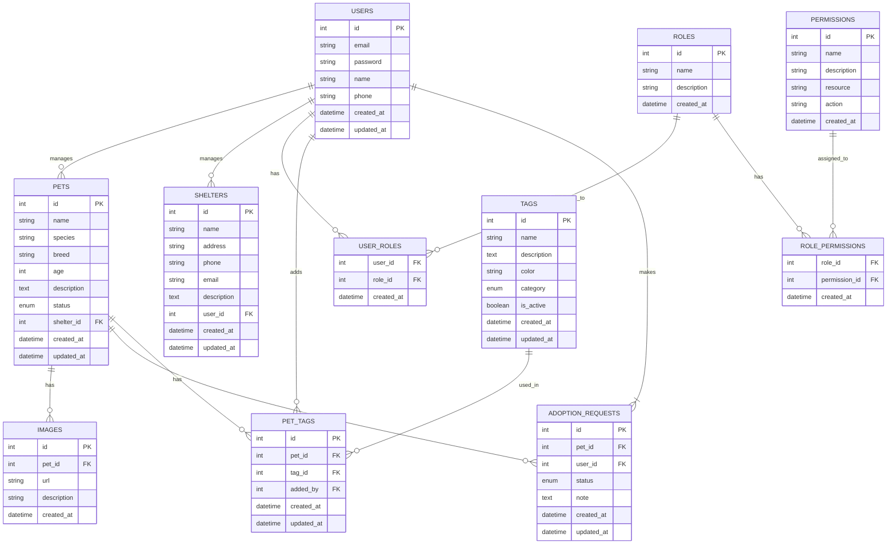
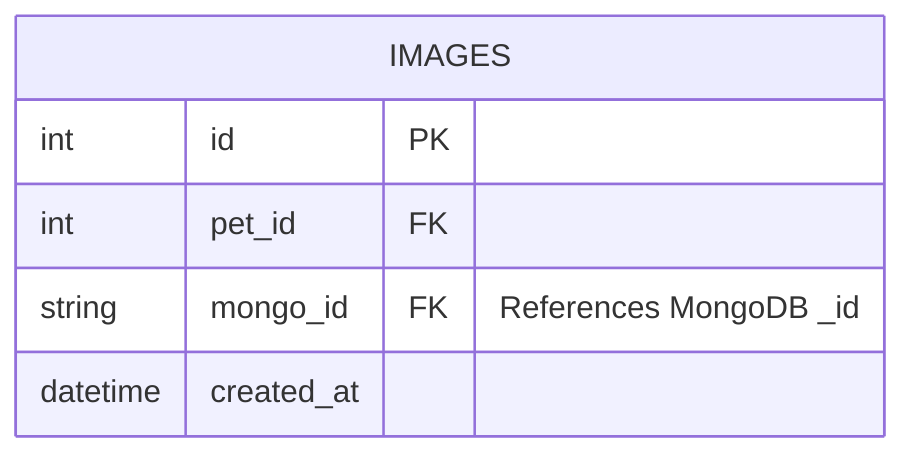

# PetMatch API

A REST API for an animal adoption platform, developed for the Web 2 course in the Software Engineering program at UTFPR.

## About the Project

This API serves as the backend for a platform that connects animal shelters and independent protectors with people interested in adopting pets. It enables the registration of animals available for adoption, manages adoption applications, and facilitates the matching process between pets and potential adopters.

## Technologies Used

- **Node.js** (v18+): JavaScript runtime environment.
- **Express**: Minimalist framework for building web servers.
- **JavaScript**: Programming language used in the project.
- **Swagger**: API documentation and testing.

## API Documentation

The API documentation is generated using Swagger and can be accessed at:
[http://localhost:3000/api-docs](http://localhost:3000/api-docs)

## Database Structure



### User Roles
- **Admin**: Full system access
- **Shelter**: Manage shelter profile and pets
- **Adopter**: Browse pets and submit adoption requests

### Database Details
- **Relational Database**: PostgreSQL for structured data
- **Non-Relational Database**: MongoDB for storing pet images and metadata

### Cross-Database Relationship
The IMAGES table in PostgreSQL maintains a reference to MongoDB documents using the following structure:



### MongoDB Collections

```javascript
// Images Collection
{
  _id: ObjectId,          // Referenced by PostgreSQL images.mongo_id
  pet_id: Number,         // Reference to PostgreSQL pet.id
  images: [{
    url: String,
    description: String,
    main: Boolean,         // Flag for main pet image
    metadata: {
      size: Number,
      format: String,
      dimensions: {
        width: Number,
        height: Number
      },
      tags: [String]
    },
    created_at: Date,
    updated_at: Date
  }]
}

// Logs Collection
{
  _id: ObjectId,
  entity_type: String,     // 'pet', 'user', 'shelter', 'adoption'
  entity_id: Number,       // Reference to PostgreSQL id
  action: String,          // 'create', 'update', 'delete'
  changes: Object,         // Document with changed fields
  user_id: Number,         // Who made the change
  timestamp: Date
}
```

## Requirements

- **Node.js** version 18.0.0 or higher.
- **npm** (Node.js package manager).

## Installation

1. Clone the repository:
   ```bash
   git clone git@github.com:carloskvasir/api_js.git
   cd api_js
   ```

2. Install the dependencies:
   ```bash
   npm install
   ```

3. Start the server:
   ```bash
   npm start
   ```

## Available Endpoints

### Pets
- `GET /pets` - List all available pets
- `GET /pets/:id` - Get details of a specific pet
- `POST /pets` - Register a new pet for adoption
- `PUT /pets/:id` - Update pet information
- `DELETE /pets/:id` - Remove a pet listing

### Tags
- `GET /tags` - List all active tags
- `GET /tags/:id` - Get details of a specific tag
- `POST /tags` - Create new tag
- `PUT /tags/:id` - Update tag information
- `DELETE /tags/:id` - Deactivate tag
- `GET /tags/category/:category` - Get tags by category
- `GET /tags/stats/usage` - Get tag usage statistics
- `POST /pets/:petId/tags` - Add tags to a pet
- `DELETE /pets/:petId/tags/:tagId` - Remove tag from pet
- `GET /pets/search-by-tags` - Search pets by tags

### Shelters/Protectors
- `GET /shelters` - List all registered shelters/protectors
- `POST /shelters` - Register new shelter/protector
- `PUT /shelters/:id` - Update shelter/protector information

### Adoption Applications
- `POST /adoptions` - Submit adoption application
- `GET /adoptions/:id` - Check application status
- `PUT /adoptions/:id` - Update application status

## Development Roadmap

- [ ] Basic CRUD for pets
- [ ] Shelter/protector registration system
- [ ] Adoption application workflow
- [ ] Pet search and filtering
- [ ] Image upload for pets

## License
This project is licensed under the Mozilla Public License 2.0 (MPL-2.0).
See the [LICENSE](LICENSE) file in the project root for the full license text.

## Contact
- LinkedIn: [linkedin.com/in/carloskvasir](https://linkedin.com/in/carloskvasir)
- GitHub: [github.com/carloskvasir](https://github.com/carloskvasir)

